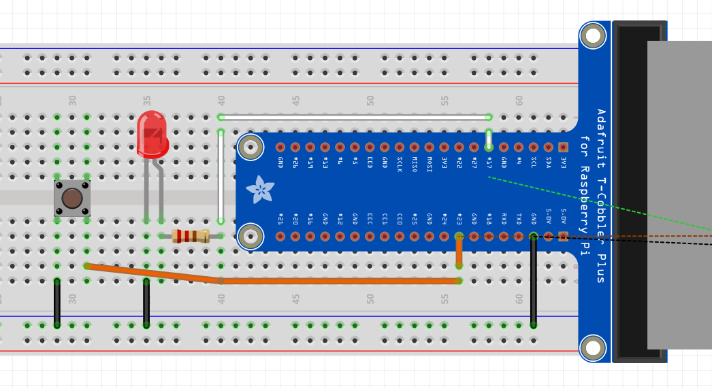

# Esempi GPIO -- LED e LED + Pulsante

Documentazione degli esempi di laboratorio basati sul wrapper
`gpio_wrapper`. Gli esempi mostrano l'utilizzo base dei GPIO della
Raspberry Pi in C.

## 📷 Cablaggio esempi LED e LED+Pulsante




> Nota: il numero del pin è in numerazione BCM.

------------------------------------------------------------------------

# 1️⃣ Esempio: LED lampeggiante

## 🎯 Obiettivo

Accendere e spegnere un LED collegato a un pin GPIO con intervallo di 1
secondo.

## 🔌 Collegamenti

-   GPIO17 → Anodo LED → Resistenza (220Ω--330Ω)
-   Catodo LED → GND


## 💻 Codice

``` c
#include "gpio.h"
#include <unistd.h>

#define LED 17

int main() {

    gpio_out(LED, 0);

    while (1) {
        gpio_write(LED, 1);
        sleep(1);
        gpio_write(LED, 0);
        sleep(1);
    }

    gpio_close();
    return 0;
}
```

## ⚙️ Compilazione

    gcc led.c gpio.c -o led -lgpiod

Esecuzione:

    sudo ./led

------------------------------------------------------------------------

# 2️⃣ Esempio: LED + Pulsante

## 🎯 Obiettivo

Accendere il LED quando il pulsante è premuto.

## 🔌 Collegamenti

-   GPIO17 → LED → Resistore → GND\
-   GPIO23 → Pulsante → GND

> Il pulsante è collegato verso GND (logica attiva alta se si usa
> pull-up esterno).


## 💻 Codice

``` c
#include "gpio.h"
#include <unistd.h>

#define LED 17
#define BTN 23

int main() {

    gpio_out(LED, 0);
    gpio_in(BTN);

    while (1) {

        if (gpio_read(BTN))
            gpio_write(LED, 1);
        else
            gpio_write(LED, 0);

        usleep(10000);
    }

    gpio_close();
    return 0;
}
```

## ⚙️ Compilazione

    gcc led_button.c gpio.c -o led_button -lgpiod

Esecuzione:

    sudo ./led_button

------------------------------------------------------------------------

# 🧠 Concetti introdotti

-   GPIO input/output
-   Struttura `while(1)`
-   Uso di `if / else`
-   Logica digitale (0 / 1)
-   Interazione hardware di base

------------------------------------------------------------------------

# 📌 Note didattiche

-   I pin sono in numerazione BCM.
-   È consigliato l'uso di una resistenza in serie al LED.
-   Per stabilità maggiore sul pulsante si può utilizzare una resistenza
    di pull-up o pull-down.
